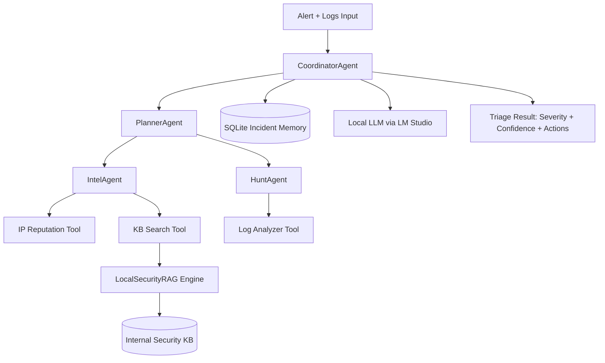

# Cyber-Defense Triage First Responder

Autonomous cybersecurity assistant that analyzes security alerts, coordinates first-response triage, and recommends immediate containment actions.

This project implements an agentic SOC workflow with planning, tool orchestration, memory, retrieval-augmented reasoning, and local LLM inference.

---

## 1) Problem Statement

Build an autonomous **Cyber-Defense Triage First Responder** that:

- Accepts a security alert and related logs
- Queries IP reputation intelligence
- Detects signs of lateral movement from logs
- Retrieves internal security knowledge (playbooks/guidelines)
- Produces severity, confidence, evidence-backed findings, and immediate actions

---

## 2) Theoretical Foundations (Theory)

### 2.1 Agentic AI and Multi-Agent Orchestration
The system is modeled as specialized agents coordinated by a controller:

- **PlannerAgent**: decomposes triage into sequential decision steps
- **IntelAgent**: executes external/internal intel gathering tasks
- **HuntAgent**: analyzes host/security logs for suspicious patterns
- **CoordinatorAgent**: orchestrates execution and synthesizes final decision

This mirrors SOC workflows where different analyst roles collaborate under incident command.

### 2.2 Planning and Reasoning
The planner uses decision-tree style decomposition:

1. Assess source risk
2. Investigate lateral movement
3. Retrieve response playbook context
4. Determine severity and containment actions

This ensures explainable step-by-step reasoning rather than single-shot generation.

### 2.3 Retrieval-Augmented Generation (RAG)
RAG grounds conclusions in internal knowledge base documents.

- Markdown KB documents are split into **sections and chunks**
- Query terms are expanded with security-aware synonyms
- Retrieval uses weighted lexical scoring (IDF overlap + coverage + phrase boost)
- Top relevant chunks are provided as evidence in output

This reduces hallucination risk and improves consistency with internal response policy.

### 2.4 Memory Integration
Persistent memory is stored in SQLite:

- Incident metadata (status, severity, confidence)
- Step-by-step execution history
- Timestamped audit trail for triage explainability

This enables traceability and post-incident review.

### 2.5 Hybrid AI (Local + Tooling)
The system combines:

- **Local LLM (LM Studio)** for synthesis/summarization
- **Deterministic tools** for reputation lookup, log detection, and retrieval

This pattern is robust for security operations where deterministic evidence must drive conclusions.

---

## 3) System Architecture

### 3.1 High-Level Flow
1. Alert + logs enter the coordinator
2. Planner generates triage plan
3. Intel and Hunt agents execute tool calls
4. RAG retrieves internal KB evidence
5. Coordinator computes severity/confidence and actions
6. Local LLM generates concise analyst summary
7. Incident and steps are written to memory DB

### 3.2 Architecture Diagram



### 3.3 Component Map

- `app/agents/coordinator.py` — orchestration and decision synthesis
- `app/agents/planner_agent.py` — plan generation
- `app/agents/intel_agent.py` — intel and KB retrieval workflow
- `app/agents/hunt_agent.py` — log-centric threat hunting workflow
- `app/tools/ip_reputation.py` — AbuseIPDB/local feed reputation lookup
- `app/tools/log_analyzer.py` — lateral movement indicator detection
- `app/tools/kb_search.py` — KB query wrapper over RAG engine
- `app/rag.py` — section-aware chunked retrieval and scoring
- `app/memory.py` — SQLite persistence and incident history
- `app/llm_client.py` — LM Studio OpenAI-compatible client
- `app/api.py` — FastAPI endpoints for dashboard/API usage
- `dashboard/` — React dashboard UI

---

## 4) Requirement Coverage Matrix

| Required Capability | Implemented In | Status |
|---|---|---|
| Agent Orchestration | `CoordinatorAgent` + specialist agents | ✅ |
| Planning & Reasoning | `PlannerAgent.build_plan()` | ✅ |
| Memory Integration | SQLite incident/step memory (`app/memory.py`) | ✅ |
| Retrieval-Augmented Generation | `app/rag.py` + `data/security_kb/*` | ✅ |
| Offline/Local Model Usage | LM Studio via `app/llm_client.py` | ✅ |
| Tool Usage | IP reputation, log analyzer, KB search | ✅ |

---

## 5) What the System Does (Operational Behavior)

Given an alert, the system returns:

- `incident_id`
- `severity` (low/medium/high/critical)
- `confidence` score
- `findings`:
  - `ip_reputation`
  - `lateral_movement_analysis`
  - `kb_context` (retrieved chunks)
  - `plan` (decomposed steps)
  - `llm_summary`
- `immediate_actions` for SOC first response

---

## 6) Project Structure

```text
app/
  agents/
    coordinator.py
    planner_agent.py
    intel_agent.py
    hunt_agent.py
  tools/
    ip_reputation.py
    log_analyzer.py
    kb_search.py
  api.py
  config.py
  llm_client.py
  main.py
  memory.py
  models.py
  rag.py
  runtime.py

data/
  alerts/sample_alert.json
  logs/sample_windows_security.log
  security_kb/
    lateral_movement_playbook.md
    ip_reputation_guidelines.md
  threat_feeds.json
  memory.db (generated at runtime)

dashboard/
  src/
    App.jsx
    api.js
    main.jsx
    styles.css
  package.json

requirements.txt
.env.example
```

---

## 7) Prerequisites

- Python 3.10+
- Node.js 18+
- LM Studio running a local model with OpenAI-compatible server enabled

Typical LM Studio endpoint:
- `http://127.0.0.1:1234/v1`

---

## 8) Environment Configuration

Copy environment template:

```bash
copy .env.example .env
```

Main variables:

- `LM_STUDIO_BASE_URL` — local model API base URL
- `LM_STUDIO_MODEL` — loaded model identifier
- `ABUSEIPDB_API_KEY` — optional (fallback to local feed if empty)
- `MEMORY_DB_PATH` — SQLite DB path

---

## 9) Installation

### 9.1 Backend

```bash
python -m venv .venv
.venv\Scripts\activate
pip install -r requirements.txt
```

### 9.2 Frontend

```bash
cd dashboard
npm install
cd ..
```

---

## 10) How to Run

### 10.1 Run via CLI (quick test)

```bash
python -m app.main --alert data/alerts/sample_alert.json --logs data/logs/sample_windows_security.log
```

### 10.2 Run Backend API (FastAPI)

```bash
uvicorn app.api:app --reload --host 0.0.0.0 --port 8000
```

API endpoints:

- `GET /health`
- `POST /triage`

### 10.3 Run Dashboard (React)

```bash
cd dashboard
npm run dev
```

Open:
- `http://localhost:5173`

Default UI API target:
- `http://127.0.0.1:8000`

---

## 11) API Contract

### `POST /triage` request body

```json
{
  "alert_id": "ALERT-2026-00110",
  "source_ip": "185.193.88.42",
  "destination_host": "FIN-WS-014",
  "user": "jane.doe",
  "summary": "Multiple failed authentications followed by remote service execution attempt",
  "logs_text": "...raw log lines..."
}
```

Alternative:
- send `logs_path` instead of `logs_text`

### Response (high-level)

```json
{
  "incident_id": "INC-...",
  "severity": "high",
  "confidence": 0.82,
  "findings": { "...": "..." },
  "immediate_actions": ["..."]
}
```

---

## 12) Example Demo Sequence (5 minutes)

1. Start LM Studio and load local model
2. Start FastAPI backend
3. Start React dashboard
4. Submit sample alert in UI
5. Highlight:
   - plan steps (reasoning)
   - evidence from tools and RAG
   - severity/confidence outcome
   - immediate SOC actions
6. Show memory persistence in `data/memory.db`

---

## 13) Security Notes and Limitations

- Prototype triage assistant for educational/academic use
- Not a replacement for full SOC/SIEM/SOAR stack
- Regex-based log detection can be improved with richer parsing and rule packs
- Current RAG is lexical/weighted retrieval (can be extended with embeddings)
- Analyst validation is required before automated containment actions

---

## 14) Future Improvements

- Hybrid lexical + embedding retrieval with reranking
- SIEM connectors (Splunk/Elastic)
- SOAR actions (block IP, disable account) with approval gates
- Incident timeline visualization in dashboard
- Multi-tenant role-based access control

---

## 15) Conclusion

This implementation satisfies the required agentic AI objectives: orchestrated multi-agent execution, explicit planning, memory, RAG, local/offline model usage, and practical tool interaction for cybersecurity first-response triage.
